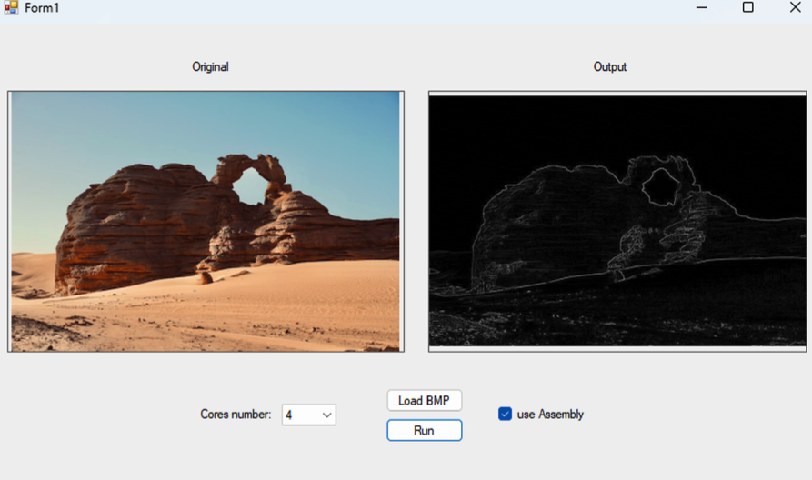
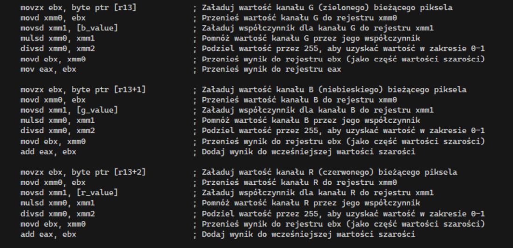
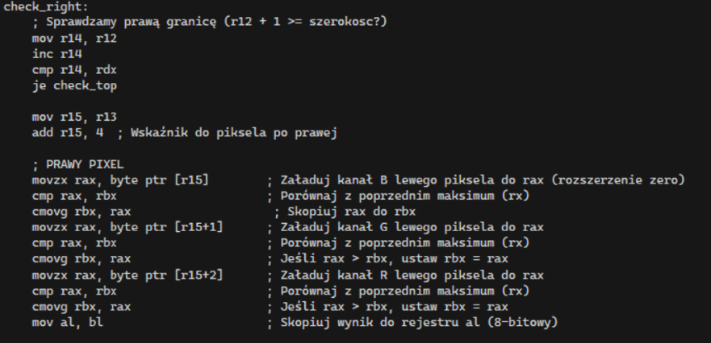
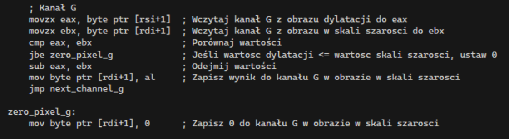
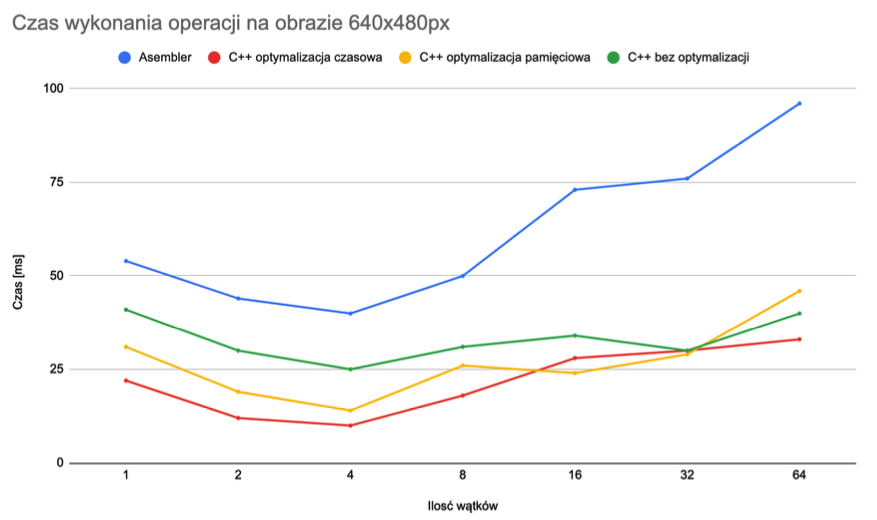
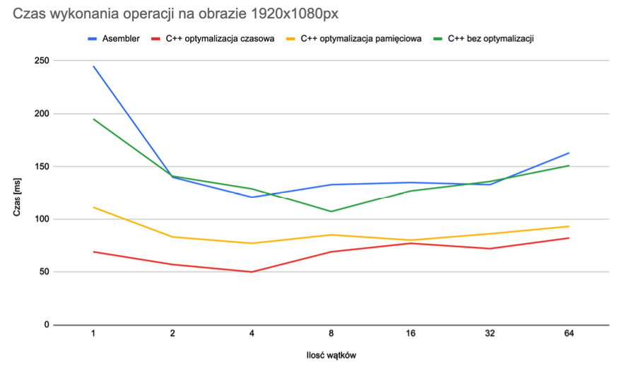
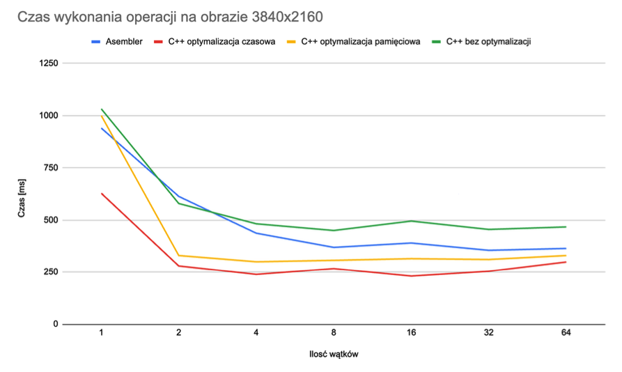

# Edge Detection via Morphological Dilation

## Project Overview

This project implements external edge detection using image dilation and subtraction. The method involves performing a morphological dilation on a grayscale image and subtracting the original grayscale image from the result. The application supports two implementations:

- **High-level language (C++)**
- **Assembly (ASM)**

The goal is to compare performance and behavior between these implementations.

## Features

- Convert RGBA images to grayscale
- Apply 3x3 dilation operation
- Subtract original image from dilated image to extract external edges
- Multi-threaded image processing
- Interactive GUI
- Performance benchmarking on various image sizes and thread counts

## Technologies

- C++ (WinAPI)
- x86 Assembly (MASM)
- Windows DLLs
- Parallels Desktop (for ARM emulation)

## GUI Overview



- **Left Panel**: Original BMP image
- **Right Panel**: Processed image (grayscale/dilated/edges)
- **Dropdown**: Select number of threads (1 to 64)
- **Buttons**:
  - `Load BMP`: Load an input image
  - `Run`: Execute the algorithm
- **Checkbox**: `Use Assembly` – switch between C++ and ASM implementation

## Input Parameters

- `Input image`: BMP format image
- `Thread count`: [1, 2, 4, 8, 16, 32, 64]
- `Implementation`: C++ / Assembly

## Functions

### `ConvertToGrayscaleAsm`

Converts an RGBA image to grayscale using the formula:

```
Gray = 0.2989 * R + 0.5870 * G + 0.1140 * B
```

#### Applying a formula in the code for a single pixel


### `DilateImageAsm`

Applies a 3x3 dilation mask on the grayscale image. Uses maximum value of neighboring pixels.

#### Dilatation fragment


### `CombineImages`

Performs pixel-by-pixel subtraction of the grayscale image from the dilated image.

```
if dilated_pixel > grayscale_pixel:
    result_pixel = dilated_pixel - grayscale_pixel
else:
    result_pixel = 0
```

#### Combining images in asm



## Performance Benchmark

Tested on an Apple M3 Pro via Parallels Desktop (Windows 11 x86 emulation). 

### Image sizes:

- Small: 640x480
- Medium: 1920x1080
- Large: 3840x2160

### Versions:

- ASM
- C++ (with time optimizations)
- C++ (with memory optimizations)
- C++ (no optimization)

### Observations:

- **Medium images**: Greatest time savings with 2–4 threads
- **Large images**: Parallelization has diminishing returns after 8 threads
- **C++ optimized**: Often outperforms ASM due to compiler optimizations

## Performance Benchmark

Tested on an Apple M3 Pro using Parallels Desktop (Windows 11 x86 emulation).

### Execution time vs. number of threads

#### Small image (640x480)


#### Medium image (1920x1080)


#### Large image (3840x2160)


### Color Legend

- 🔵 **Blue** – Assembly (ASM)
- 🔴 **Red** – C++ with time optimization
- 🟡 **Yellow** – C++ with memory optimization
- 🟢 **Green** – C++ without optimization


## Conclusion

This project illustrates how high-level language optimizations can often rival or surpass low-level implementations in modern computing environments. Additionally, it provided deep insight into:

- Low-level memory handling
- Register management
- Image processing techniques

## Author

**Radosław Rajda**  


---


